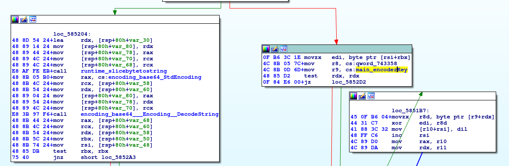
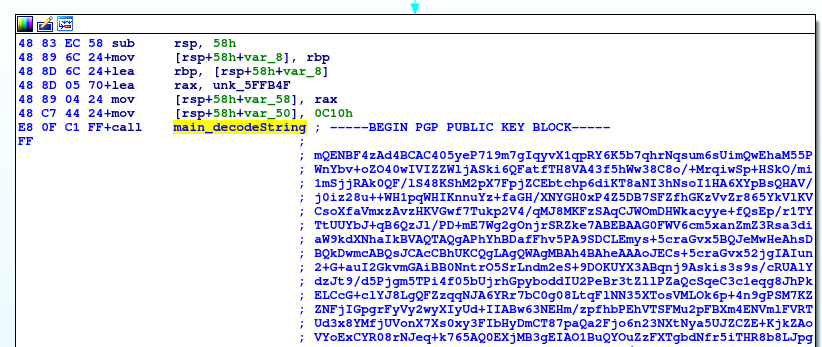
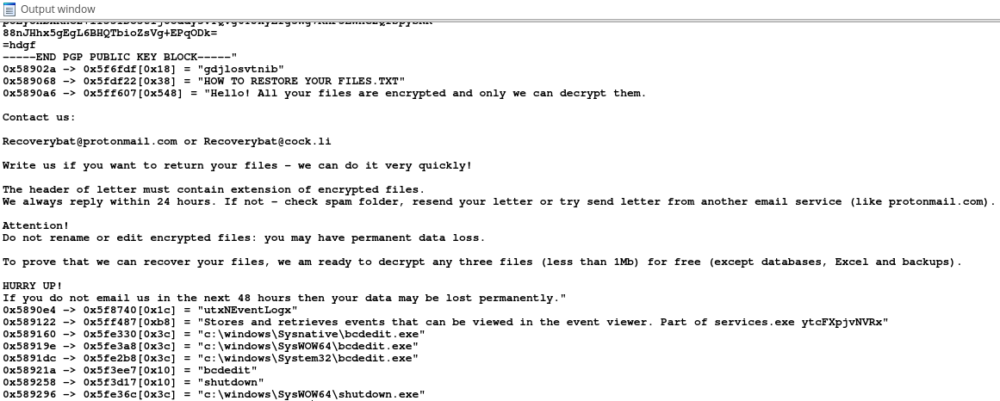

# Snatch String Decryptor
Ida C (IDC) script for decrypting obfuscated strings in the Snatch Ransomware.

Tested with publicly available samples of Snatch Ransomware in July 2020.

Testing samples SHA265 (available on [Any.Run](https://app.any.run)):
- 3160b4308dd9434ebb99e5747ec90d63722a640d329384b1ed536b59352dace6
- 794d549579812a90e14ef36b70c660900086e25a989e987bb642dff5239ee133

## Usage

Snatch Ransomware samples are written in Go and packed with UPX packer. First of all, they need to be unpacked, for example with using

```upx -d <sample>```

Then, unpacked sample can be opened in IDA Freeware (Interactive Disassembler by Hex Rays) and embedded obfuscated strings can be decoded with this IDC script.

## How it works

This script is inspired by [LIFARS Ida Python snatch_decrypt_strings.py](https://github.com/Lifars/IDA-scripts/blob/master/snatch_decrypt_strings.py).



The strings in Snatch Ransomware are obfuscated with Base64 encoding, XOR cipher and Base64 encoding, again. This script extracts the `main.encoderKey` used for XOR, then finds all calls to Snatch `main.decodeString` function and extracts its argument (obfuscated string). Finally, this script decrypts all obfuscated scripts, prints them to the Output window and makes comments with decrypted values.




